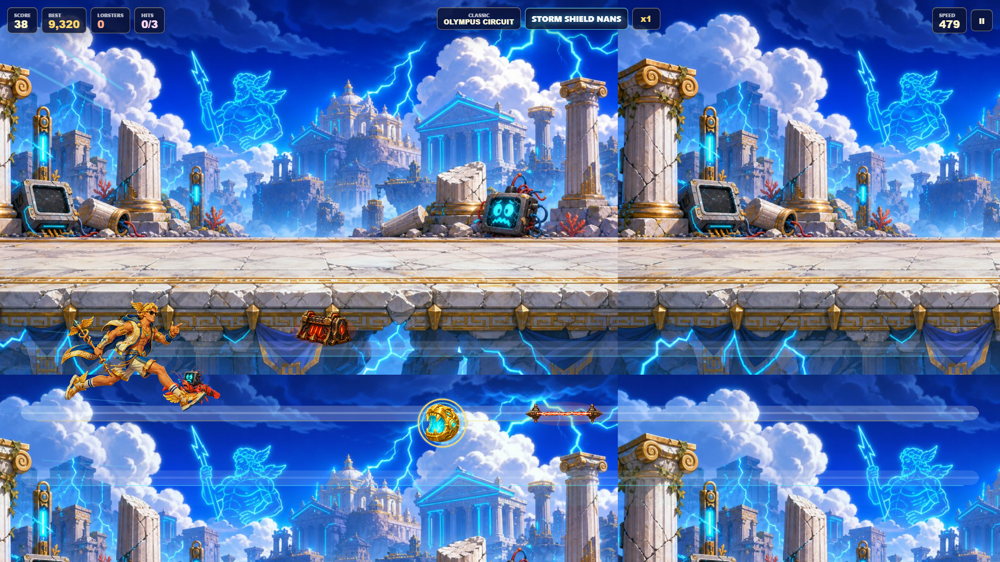

# Hermes: Godspeed

Hermes: Godspeed is a Phaser and Vite endless runner about winged speed, divine appetite, and one more run.



## Features

- Lane-based running, jumping, and sliding.
- Lobster collecting, combo scoring, obstacles, and powerups.
- Phase-based spawn variety and run stats.
- Local high score persistence.
- Local mission progression, lifetime stats, laurels, and cosmetic unlocks.
- Procedural music and sound effects.
- Optional in-browser MP4 run recording when supported by the browser.

## Controls

- `Left` / `A`: move left
- `Right` / `D`: move right
- `Up` / `W` / `Space`: jump
- `Down` / `S`: slide
- `P`: pause

Touch controls are available on mobile layouts.

## Development

```bash
npm install
npm run dev
```

Open the local Vite URL shown in the terminal.

## Build

```bash
npm run build
```

The public release build is written to `dist/` and can be deployed to any static web host.

## Release Check

```bash
npm ci
npx playwright install
npm run release:check
npm audit --omit=dev --audit-level=moderate
```

The release check builds the production app, runs unit tests, and runs Playwright against a production preview on desktop and mobile. See `RELEASE.md` for the full checklist.

`npx playwright install` is a one-time prerequisite that downloads the browser binaries the e2e suite drives; run it before `npm run test:e2e` or `npm run release:check`.

`npm audit --omit=dev` excludes dev-only tooling (for example the `voice:intro` Kokoro script) that is never included in the shipped static artifact in `dist/`.

## Recording Notes

MP4 run recording depends on browser support for `canvas.captureStream()` and `MediaRecorder` with MP4 MIME types. If MP4 recording is not supported, the recording controls are disabled rather than saving a mislabeled file.

## Local Progression

Progression is stored in browser `localStorage` under `hermes-godspeed.profile.v1`. Missions update at game over, grant laurels, and rotate into new goals. Laurels unlock cosmetic trails, title badges, and HUD accents only; they do not change gameplay balance.

The start panel includes a reset control for the progression profile. The legacy high score key is still read separately so older local scores continue to display.

Settings are stored separately under `hermes-godspeed.settings.v1` and include music, sound effects, and reduced motion.

## Trailer

The tracked `trailer/` directory is the canonical Remotion + Playwright source for the official launch video. It has its own dependencies, but shares the current game and artwork as its source of truth. Generated captures and the final MP4 remain ignored and are not part of `dist/`.

```bash
npm --prefix trailer ci
npm run trailer:render
```

The verified local output is written to `trailer/out/hermes-godspeed-launch-trailer.mp4`. See `trailer/README.md` for preview, capture, and render details.

## License

Source code is MIT licensed. See `LICENSE`.

Asset release status is tracked separately in `ASSETS.md`. Privacy details are in `PRIVACY.md`.
